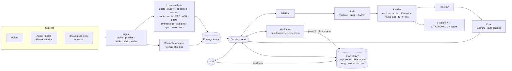

# montaje — an agentic, general-purpose video editor

> Drop in a pile of footage (videos, photos, Live Photos) from folders or an Apple Photos shared album, optionally a music track and a short brief, and get back a **professional-looking** edit (cut to the music, designed transitions, sound design, consistent color, animated captions and titles) **plus** an editable timeline you can open in DaVinci Resolve.

This README is the build specification. It is written for a coding agent (and the human reviewing it). Read §0 first.

---

## 0. How to use this document (for the building agent)

- Build **in milestone order (§29)**. Each milestone has acceptance criteria; do not start the next one until they pass. **M1 is a vertical slice**: a watchable edit of real footage comes before hardening anything.
- This document names tools and APIs, **not pinned versions**. Verify current versions and APIs at build time. If a listed tool does not install or work on macOS/Apple Silicon, use the listed fallback and record the choice in `DECISIONS.md`.
- Keep `DECISIONS.md` as an append-only log: date, decision, alternatives, evidence.
- Target machine: **MacBook Pro, Apple M5, 48 GB unified memory, macOS 27**. Linux support is nice-to-have for everything except the Apple Photos source and Apple Vision helpers.
- Every component must be runnable and testable on its own. Prefer small, pure, cached functions over clever orchestration.
- Do not hardcode anything project-specific (e.g. "vlogs start with a hand covering the lens"). See §2 and §12.
- The core (ingest, rails, render pipeline) is written by you, the building agent. The **craft library** (§13) is where visual and audio quality comes from: treat it as a design product, not boilerplate.

---

## 1. What it is

**Input**
- Footage: videos, photos, Live Photos, slo-mo, from local folders or Apple Photos albums (including shared albums).
- Optional: music track, brief (goal, format, duration, tone), style preset, reference edits the user likes.

**Output**
- Final render (MP4, H.264/HEVC, SDR by default).
- Editable timeline (OpenTimelineIO + FCPXML) referencing the **original** media, plus audio stems, an SRT file and a graphics overlay track.
- The `EditPlan` JSON (source of truth of the edit) and a human-readable summary.

**First real use case:** a festival aftermovie from ~100 iPhone videos (4K HEVC, HDR) shot by several people. It contains vlogs with recurring conventions (e.g. opening by uncovering the lens with a hand and closing by covering it; these must be *discovered*, not coded), stage/music clips, dancing clips, and clips with speech, music only, or near-silence.

**Quality target:** clearly better than typical social-media edits, comparable to a good template-based edit by a skilled creator; with user feedback or a short manual pass in Resolve, close to a professional editor. The footage itself is the ceiling: the system selects and disguises weak material, it does not invent quality.

**Non-goals (v1):** generating footage with AI, a full interactive NLE UI, cloud/multi-user hosting.

---

## 2. Design principles

1. **Craft lives in the library; judgment lives in the agent.** Professional feel comes from micro-timing, motion design, typography, sound design and color. These are hand-crafted, reviewed components and rules (§13–15). The agent chooses, combines, parameterizes and times them. It writes new components only when the library lacks something, through a gated workshop (§21).
2. **The LLM picks moments; code picks frames.** Vision-language models understand *what* happens but are imprecise about *when* (they sample video at a few fps). Every decision is snapped to deterministic boundaries (shot cuts, word boundaries, beats, occlusion edges) by the rails (§18).
3. **The director is an agent with tools, not a pipeline step.** Creativity (concept, selection, juxtaposition, rhythm, structure) lives in the agent. Deterministic modules are its eyes and hands, exposed as tools it calls when it decides to.
4. **Quality rails are non-bypassable.** Tone-mapping, frame-rate normalization, snapping, no mid-word cuts, color normalization, loudness, safe areas: always enforced, whatever the agent does. The agent cannot modify rails or core code.
5. **Nothing project-specific in code.** Low-level detectors emit meaning-free events. Conventions are discovered from the footage, confirmed by the user and stored as data.
6. **The system gets better with use.** User feedback updates component scores; good edits become styles; reference videos become styles; agent-created components graduate into the library after review.
7. **Analyze once, iterate cheaply.** Content-addressed cache for every artifact.
8. **Proxies for thinking, originals for pixels.** Analysis runs on proxies; final render conforms from originals, only for selected ranges. Heavy work scales with *output* duration.
9. **Everything is inspectable.** Every intermediate is a file a human can open. Every agent session is logged.

---

## 3. Architecture overview



---

## 4. Tech stack

| Concern | Choice | Fallback / notes |
|---|---|---|
| Core language | Python 3.12, `uv`, `pydantic` v2, `typer`, `rich` | — |
| Metadata store | SQLite | — |
| Vector search | LanceDB **or** `sqlite-vec` (decide in M3) | ChromaDB |
| Apple Photos | Swift CLI `photos-bridge` using **PhotoKit** | Manual "Export Unmodified Original" |
| Probe / transcode / color filters | `ffmpeg` / `ffprobe` with VideoToolbox, `zscale` (libzimg), `lut3d`; `exiftool` | — |
| Shot detection | TransNetV2 | PySceneDetect |
| ASR | `mlx-whisper` (large-v3-turbo class), word timestamps | faster-whisper / WhisperX |
| Forced alignment (lyrics, scripts) | CTC forced aligner on Demucs vocals | Whisper word timestamps + text alignment |
| VAD | Silero VAD | WebRTC VAD |
| Audio event tagging | CLAP (zero-shot labels) | PANNs |
| Source separation | Demucs | skip; flag clip |
| Speech cleanup | ffmpeg `afftdn` / `arnndn`, high-pass, presence EQ | — |
| Beats / downbeats | Beat This! | madmom / librosa |
| Music structure | `allin1` | librosa novelty + energy segmentation |
| Visual embeddings | SigLIP / CLIP (open_clip or MLX port) | — |
| Subjects / faces / saliency | Apple Vision via Swift helper | MediaPipe |
| Semantic video understanding | Gemini Flash via `google-genai` (model id in config, currently `gemini-3.8-flash`) | local VLM via MLX |
| Director | Claude tool use; iterate on `claude-sonnet-5`, final on `claude-opus-5-5` | any tool-use LLM |
| Tool protocol | MCP server exposing all tools | direct calls |
| Composition / render | Remotion (React/TypeScript, `zod` params) | ffmpeg-only renderer for cuts-only drafts |
| Fonts | Bundled OFL-licensed fonts (e.g. from Google Fonts) | — |
| SFX | Local library with per-file license metadata (CC0 or user-licensed packs) | — |
| Sandbox for agent code | subprocess with resource limits, no network; Docker if available | — |
| Timeline export | OpenTimelineIO (+ FCPXML adapter) | — |
| Critic | Gemini (watches preview) + stills grids | Claude on contact sheets |
| Music generation | ElevenLabs Music API (composition plans with per-section durations, inpainting, word timestamps) | Google Lyria 3; Stable Audio Open locally for offline drafts only |
| Music library | Local licensed tracks with auto-computed metadata | — |

---

## 5. Repository layout

```
montaje/
  pyproject.toml
  README.md  DECISIONS.md  EVAL.md
  config/defaults.yaml
  src/montaje/
    cli.py  config.py
    models/            # pydantic = single source of truth
      asset.py events.py cliplog.py brief.py conventions.py
      editplan.py style.py critique.py library.py
    sources/           base.py folder.py apple_photos.py icloud_link.py
    ingest/            probe.py hashing.py proxy.py hdr.py audio.py stills.py livephoto.py slomo.py report.py
    analysis/
      local/           shots.py quality.py occlusion.py motion.py audio_events.py vad.py asr.py
                       separation.py loudness.py embeddings.py subjects.py sync.py dedupe.py
                       color_stats.py contact_sheet.py
      semantic/        gemini_client.py clip_log.py prompts/
      plugins/         # promoted agent-written analyzers (§21)
    music/             beats.py structure.py edit.py lyrics.py
    index/             store.py search.py patterns.py
    library/           registry.py scores.py gallery.py
    sound/             spotting.py sfx.py mix.py
    color/             normalize.py match.py grade.py
    director/          agent.py tools.py mcp_server.py phases.py budget.py prompts/
    plan/              ops.py snap.py validate.py rails.py rhythm.py summary.py
    render/            conform.py remotion_bridge.py otio_export.py overlays.py
    critic/            review.py autochecks.py
    workshop/          sandbox.py gates.py promote.py
    styles/            registry.py learn.py
  tools/photos-bridge/ # Swift package (PhotoKit + Vision)
  library/
    tokens/            # design tokens: timing, easing, type, color, safe areas
    components/        # stable Remotion components (TSX + meta)
    sfx/               # audio files + sfx.yaml metadata (license per file)
    luts/              # .cube LUTs with license
    fonts/             # OFL fonts + licenses
    styles/            # style YAMLs
    gallery/           # rendered previews of every component/params preset
  render/remotion/
    package.json
    src/Root.tsx src/Edit.tsx src/schema.ts (generated)
    src/library -> ../../library/components   # symlink or build step
    src/drafts/        # project-scoped agent components
  tests/  unit/ fixtures/ e2e/ gallery/
  projects/            # gitignored workspaces
```

---

## 6. Project workspace

```
projects/<slug>/
  project.yaml   sources.yaml   montaje.db
  media/
  cache/<asset_id>/  proxy.mp4  audio_16k.wav  audio_48k.wav  thumbs/  analysis/<analyzer>@<ver>.json
  conventions.yaml
  plans/plan_v###.json  plan_v###.md
  intermediates/
  renders/preview_v###.mp4  final_v###.mp4
  exports/timeline_v###.otio  .fcpxml  captions_v###.srt  stems/  overlays_v###.mov
  drafts/            # workshop artifacts for this project
  logs/agent_*.jsonl  costs.jsonl  feedback.jsonl
```

- `asset_id` = sha256(file size ‖ first 8 MB ‖ last 8 MB ‖ duration).
- Analysis cache key: `(asset_id, analyzer, analyzer_version, params_hash)`.
- All commands idempotent and resumable (per-asset stage status table). Atomic writes (temp + rename).

`project.yaml` (all optional except name):
```yaml
name: festival-2026
goal: "aftermovie of our festival day"
format: {aspect: "9:16", resolution: 1080x1920, fps: 30, dynamic_range: sdr}
duration: {target_s: 75, tolerance_s: 15}
music: {path: media/music/track.mp3, lyrics: media/music/lyrics.txt}
style: modern-festival
references: [media/refs/edit_i_like.mp4]
language: es
notes: |
  Anything the footage cannot tell the system.
```

---

## 7. Sources

```python
class Source(Protocol):
    def list(self) -> list[RemoteAsset]: ...
    def fetch(self, asset: RemoteAsset, dest: Path) -> LocalAsset: ...  # idempotent, resumable
```

### 7.1 Folder
Recursive scan (`.mov .mp4 .m4v .heic .jpg .png .dng`). Pair Live Photos (basename or content identifier).

### 7.2 Apple Photos (PhotoKit bridge)
```
photos-bridge list-albums --json
photos-bridge list --album "<name>" --json
photos-bridge export --album "<name>" --dest <dir> --prefer original|edited
photos-bridge vision --image <path> --json      # faces / humans / saliency
```
- Shared albums: `PHAssetCollection.fetchAssetCollections(with: .album, subtype: .albumCloudShared, …)`; also regular albums and the iCloud Shared Library.
- Export via `PHAssetResourceManager.writeData(for:toFile:options:)` with `isNetworkAccessAllowed = true`; progress, retries, resume.
- Resources: videos `.video` / `.fullSizeVideo` per `--prefer`; Live Photos `.photo` + `.pairedVideo`; slo-mo original high-fps `.video`.
- Emit per asset: `localIdentifier`, `creationDate` with TZ, location, duration, pixel size, `mediaSubtypes`, contributor if exposed.
- First run triggers the Photos permission prompt; document it.
- **Mandatory quality check:** Shared Albums historically stored videos at ≤720p and photos at 2048 px; since iOS/macOS 27 they store originals, but items uploaded from older OS versions may still be degraded. Compare actual vs expected resolution and list degraded assets in the report.
- If PhotoKit cannot access shared-album assets, stop with a clear message pointing to §7.4.

### 7.3 iCloud public link (optional flag)
Unofficial web-stream endpoint for albums with "Public Website" enabled. Best-effort only; may return derivatives; never the default.

### 7.4 Manual fallback
Photos → File → Export → **Export Unmodified Original** → folder source.

---

## 8. Ingest

Per asset, parallel (default 3 workers; media engines are the bottleneck):

1. **Probe:** codec, bit depth, resolution, rotation, avg vs real fps (**VFR**), primaries/transfer (HLG `arib-std-b67`, PQ `smpte2084`), Dolby Vision side data, every audio stream.
2. **Capture time:** QuickTime `creationdate` (TZ) > PhotoKit `creationDate` > mtime; record source and confidence; store UTC + offset.
3. **Kind:** `video | photo | live_photo | slomo | timelapse | screen_recording`.
4. **Audio track selection:** pick a decodable stereo track; log others; fail loudly if none.
5. **Analysis proxy:** H.264 8-bit SDR, short edge 540 px, constant project fps, 1 s GOP, AAC 48 kHz. `-hwaccel videotoolbox`; downscale before tone-mapping.
6. **Audio:** 16 kHz mono WAV, 48 kHz stereo WAV.
7. **Thumbnails:** 1 fps strip + 4 fps for first/last 2 s.
8. **Report:** `report.md` with totals, devices, HDR/SDR mix, degraded assets, VFR, audio anomalies, contact sheets.

Never modify originals.

### 8.1 HDR policy
iPhone video is HDR (HLG, often Dolby Vision 8.4) by default. Output `sdr` by default (`hdr_hlg` later). Candidate SDR paths: `zscale` linearize → `tonemap` (hable/mobius, tuned `desat`) → bt709, or AVFoundation via the Swift helper. **Decide in M0 from side-by-side stills on 5 real clips** (`montaje debug tonemap`).

### 8.2 Special media
Slo-mo keeps native fps (true slow motion without interpolation up to the fps ratio). Live Photo paired video = ~3 s micro-clip. Stills are used via Ken Burns / subject-aware pan components.

---

## 9. Local analysis

Pure, versioned, cached, parallel, fixture-tested functions. Common event format:
```json
{"asset_id": "a_3f9c", "analyzer": "occlusion@1", "type": "reveal",
 "t0": 0.00, "t1": 0.72, "score": 0.93, "data": {"mean_luma": 0.04, "lap_var": 3.1}}
```

| Analyzer | Output | Notes |
|---|---|---|
| `shots` | boundaries | |
| `quality` | per-second blur, exposure clipping, shake, noise estimate, `usable` spans | |
| `occlusion` | dark + low-detail spans, `reveal` / `cover` transitions | **no semantics** |
| `motion` | camera motion magnitude/direction per second; subject motion energy; direction of dominant motion (for motion-matched transitions) | |
| `audio_events` | speech / music / crowd / silence / other per window | |
| `vad` | speech segments | |
| `asr` | word-level transcript **only on speech segments**; Demucs first when speech overlaps music; drop low-confidence segments | Whisper hallucinates on music/silence |
| `talk_vs_vocals` | near-field talk vs stage singing | Gemini arbitrates |
| `loudness` | LUFS, peaks, crowd peaks | |
| `embeddings` | SigLIP per sampled frame | search, dedupe, match cuts |
| `subjects` | faces / people boxes, saliency, main-subject track | reframing, match-cut alignment |
| `color_stats` | per-shot Lab mean/percentiles, estimated white balance, exposure, skin-tone regions | color normalization (§15) |
| `sync` | multicam groups with offsets (audio cross-correlation on time-overlapping clips) | |
| `dedupe` | near-duplicate groups | |
| `contact_sheet` | on-demand frame grids | |

Music track: beats, downbeats, tempo, sections (§14.2). Lyrics (if provided): word-level alignment (§14.4).

---

## 10. Semantic analysis (Gemini clip logs)

- Upload proxy once (Files API), low media resolution by default, 2–4 fps sampling for clips < 60 s. Include local context in the prompt (transcript, audio events, occlusion and quality spans) to ground timestamps.
- Structured output `ClipLog`:
  ```
  summary, setting, time_of_day, shot_type (selfie|front|back|pov),
  people {count_estimate, us_present, crowd}, energy 1–5, aesthetic 1–5,
  start_description, end_description, notable_gestures[],
  moments[{t0, t1, label, why, score, kind: highlight|reaction|quote|scenic|transition_candidate|hero}],
  quotes[{t0, t1, text, speaker_hint, usable}],
  stage_music {present, description}, issues[], tags[]
  ```
- Timestamps are validated and snapped later; out-of-range entries discarded and logged.
- Bulk via Batch API; synchronous calls for the agent's `ask_video`.
- Paid tier by default (free-tier content may be used to improve Google products).
- Cache key `(asset_id, model, prompt_version)`.

---

## 11. Footage index and pattern mining

- SQLite: `assets, events, clip_logs, moments, quotes, sync_groups, status`.
- Vector store: moment/summary text embeddings (hybrid with BM25) + visual embeddings.
- `search(query, filters)` → moments with thumbnails.
- `patterns()` → recurring start/end motifs (aggregated events, descriptions, clustered start/end embeddings) with counts, examples and a contact sheet. Support for the agent, which interprets.

---

## 12. Conventions

```yaml
- id: vlog_hand_cover
  status: confirmed            # proposed | confirmed | rejected
  description: "Vlogs start by uncovering the lens with a hand and end by covering it."
  evidence: {count: 14, assets: [a_3f9c, a_81d2]}
  detection: {start_event: occlusion.reveal, end_event: occlusion.cover, max_offset_s: 1.5}
  treatment: {role: segment_boundary, use_as_transition: transition.hand_wipe, trim_outside: true}
```
Agent proposes after surveying; the user confirms. Confirmed conventions can be saved into a style/profile so future projects look for them actively.

---

## 13. Craft library (the quality core)

This is where "pro" comes from. Build it like a design system: few, excellent, consistent pieces rather than many mediocre ones.

### 13.1 Design tokens (`library/tokens/`)
- **Timing:** durations defined in *beats and frames* (e.g. `punch: 0.25 beat, min 4 frames`), resolved at render time from tempo and fps.
- **Easing:** a small curated set (e.g. `snap` = expo-out, `glide` = cubic in-out, `settle` = spring with high damping). No linear motion except where intended.
- **Typography:** 2–3 bundled OFL families (display, text, mono accent); sizes as a modular scale relative to frame height; tracking/leading presets.
- **Color:** text and accent palettes per style; contrast rules over footage (auto scrim/shadow when luminance behind text is high).
- **Safe areas:** per aspect ratio and platform (9:16 with UI overlays, 16:9, 1:1).

### 13.2 Component contract
Every component is a Remotion TSX module plus metadata:
```ts
export const meta = {
  id: "transition.whip_pan",
  version: "1.2.0",
  kind: "transition",              // transition | shot_fx | text | overlay | finishing | layout
  status: "stable",                // draft | candidate | stable | deprecated
  duration: {minFrames: 6, maxFrames: 14, default: {beats: 0.5}},
  energy: ["high"],
  tags: ["movement", "horizontal"],
  beatAnchor: "cut_point",         // which instant should land on the beat
  motionMatch: "horizontal",       // prefers shots whose motion matches
  sfx: {default: "whoosh.fast", anchor: "cut_point"},
  params: z.object({
    direction: z.enum(["left", "right"]).default("left"),
    blur: z.number().min(0).max(1).default(0.6),
  }),
  aspectRatios: ["9:16", "16:9", "1:1"],
  author: "human",                 // human | agent
};
```
Rules: animation driven only by `useCurrentFrame()` (deterministic); no network assets; fonts and textures only from `library/`; seeded randomness only; must render correctly at 24/25/30/60 fps and in every declared aspect ratio; per-frame render time within budget.

### 13.3 Initial catalog (v1 quality bar)
- **Transitions:** hard cut (the default, most frequent), whip pan (directional motion blur), zoom punch in/out, white/black dip, flash frame, hand/luma wipe (uses occlusion frames), subject mask reveal, motion-matched push, light leak / film burn (procedural), glitch / RGB split (rare, style-gated), speed-ramp bridge.
- **Shot effects:** time remap speed ramps with smooth curves, beat pulse (subtle scale on downbeats), impact shake, freeze frame with text, hero slow motion, reverse, multicam split/grid, subject-tracked reframe with eased motion.
- **Text:** word-by-word captions (3–4 styles), kinetic titles, time/place stamps ("18:40 — MAIN STAGE"), countdown, lower thirds, end card, lyric styles (§14.4).
- **Finishing:** film grain, vignette, subtle halation/bloom, letterbox option.

Each component ships with **param presets** (e.g. `whip_pan/subtle`, `whip_pan/aggressive`) because good presets matter more than infinite parameters.

### 13.4 Gallery and review
- `montaje library gallery` renders every component × preset × aspect ratio on standard test clips into `library/gallery/` plus an HTML index.
- A component becomes `stable` only after human approval in the gallery (`montaje library review`).
- **Scores:** `library/scores.json` tracks uses, survivals after user feedback (kept vs removed/changed), and explicit ratings. The director sees scores and prefers high-rated items; low scores trigger review.

---

## 14. Sound design and music editing

### 14.1 SFX library
- `library/sfx/*.wav` + `sfx.yaml`: category (whoosh, impact, riser, downlifter, tick, pop, tape_stop, crowd_bed, sub_drop…), duration, **peak offset** (the frame of the hit), loudness, energy, **license and source per file**. Never add a file without a known license.
- **Spotting rules** (style-configurable, applied automatically, overridable per shot):
  - whip / push transitions → whoosh, peak aligned to the cut;
  - zoom punch / impact shake → impact, aligned to the frame;
  - section change → riser ending exactly on the next downbeat;
  - drop → sub-drop or impact on the downbeat;
  - text pops → soft tick/pop;
  - freeze frame → tape stop or record scratch (rare);
  - vlog speech under music → subtle crowd bed to glue ambience.
- Density limits per style (e.g. max SFX per 10 s) to avoid "cheap trailer" overuse.

### 14.2 Music editing
- Music analysis: tempo, beats, downbeats, bars, sections, energy curve.
- **Fit to duration by musical edits:** remove or repeat whole phrases (4/8/16 bars) at section boundaries; join on downbeats with short equal-power crossfades; validate no tempo or key jump at the joins.
- **Endings:** cut on a final hit with a generated reverb tail, or use the track's natural outro; never a fade-out mid-phrase unless the style asks for it.
- **Audio moments:** bring in the original live audio (crowd singing, drop in the venue) crossfaded over the track at chosen points; mark them in the plan.

### 14.3 Mix
- Dialogue chain: high-pass ~80 Hz, denoise (`afftdn`/`arnndn`), presence EQ, gentle compression.
- Music ducking by envelopes under speech (J/L cuts shift envelopes accordingly).
- Bus limiter; two-pass loudness normalization (default −14 LUFS integrated, −1 dBTP).
- Stems: music, dialogue, SFX, ambience.

### 14.4 Lyrics (optional)
If the user provides lyrics text, align words to the vocals (Demucs vocals + forced alignment) and offer kinetic lyric components. Warn about rights when publishing.

---

### 14.5 Music sources and score-to-picture generation

`project.yaml` → `music.mode: provided | library | generate` (default: `provided` if a track is given, otherwise `generate`).

- **provided:** the user's track, edited to fit (§14.2).
- **library:** licensed tracks in `library/music/` with metadata computed on import (BPM, key, sections, energy curve, mood tags, license). The agent searches by concept and energy profile.
- **generate (score to picture):** instead of cutting the footage to a fixed song, the music is composed *for this edit*, like a film score:
  1. **Structure first.** The director builds the concept's sections with target durations, an energy curve (e.g. intro 8 s calm → build 20 s rising → drop 25 s peak → outro 10 s) and **sync points** (the headliner starts, a group jump) with target times.
  2. **Music brief.** The agent writes a composition plan: global styles derived from the concept (genre, tempo range, instruments, mood) plus negatives; one music section per edit section with the same duration and its own local styles; sync points placed on section boundaries so the drop lands on the best moment. Instrumental by default.
  3. **Generate variants** (default 2) with section durations strictly respected.
  4. **Analyze and choose.** Beats, downbeats, real section boundaries and energy of each variant; Gemini listens and ranks fit to the concept and footage; the agent proposes, the user picks (or auto-pick in non-interactive mode).
  5. **Re-snap.** The chosen track's actual beat grid becomes the timing grid; cuts and component anchors are re-snapped (§18).
  6. **Fix sections, not songs.** Feedback on the music ("the drop is weak", "the intro is too dark") regenerates only that section via inpainting, keeping the rest.
- **Custom lyrics (optional, off by default):** a song with lines about the day (places, inside jokes). Returned word timestamps drive kinetic lyric components. Style-gated because it easily turns cheesy.
- **Stems:** if the provider returns stems (or via Demucs otherwise), duck only melodic/vocal stems under dialogue and keep drums running, which sounds far more professional than ducking the whole track.
- **Provider interface:** `MusicGenerator` with declared capabilities (section durations, inpainting, stems, timestamps, max length). Default ElevenLabs Music; alternative Lyria 3. Do not use unofficial wrappers of services without an official API (legal and operational risk).
- **Records:** store the composition plan, provider, model, song id, variants and a license snapshot (plan tier, terms URL, date) in `projects/<slug>/music/`. The system warns if the plan tier's terms do not clearly allow the intended use.

## 15. Color pipeline

Applied at conform time, in order:
1. **Input transform:** HDR → SDR Rec.709 (§8.1).
2. **Normalization:** per-shot exposure and white-balance correction toward neutral using `color_stats` (robust gray-world with skin-tone protection); strength clamped to avoid unnatural shifts.
3. **Matching:** within sync groups and within sections, match each shot to an anchor shot (Lab statistics / histogram matching, clamped).
4. **Creative grade:** style LUT (`library/luts/`) or parametric grade (contrast curve, saturation, split toning), identical for all shots.
5. **Finishing:** grain, vignette, output sharpening (in Remotion or ffmpeg, decided in M4).

Per-shot parameters are stored in the plan (`color.normalize` auto values, overridable). `montaje debug color` renders a before/after stills grid of every shot; the critic also reviews this grid (VLMs judge stills consistency well).

---

## 16. Director agent

### 16.1 Runtime
- Tools in Python, exposed via **MCP** (`montaje mcp`). Usable from Claude Code (development; no custom loop needed) and from the built-in loop (`montaje direct`).
- Built-in loop: Anthropic SDK tool-use loop (or Claude Agent SDK). Prompt caching for the stable prefix.
- Models: iterate `claude-sonnet-5`, final `claude-opus-5-5` (config).
- Budget guard: max steps, max estimated USD, cost log.

### 16.2 Tools

| Tool | Purpose |
|---|---|
| `project_overview()` | counts, durations, devices, degraded assets, brief, music structure |
| `search_footage(query, filters)` | ranked moments |
| `get_clip_log(asset_id)` / `get_transcript(asset_id, t0?, t1?)` | details |
| `contact_sheet(...)` / `view_range(asset_id, t0, t1, fps)` | images |
| `ask_video(asset_id, t0, t1, question)` | Gemini Q&A on a range |
| `find_patterns()` / `propose_conventions()` / `get_conventions()` | §11–12 |
| `similar_shots(asset_id, t)` / `sync_group(asset_id)` | match cuts, multicam |
| `music_structure()` / `music_plan_edit(target_s)` | §14.2 |
| `music_library_search(query, energy_profile)` | §14.5 |
| `music_compose(plan, variants)` / `music_inpaint(section, changes)` / `music_rank(variants)` | §14.5 |
| `library_search(query, kind, energy)` / `library_get(id)` | components, presets, scores, gallery previews |
| `sfx_search(query)` | SFX with metadata |
| `list_styles()` / `load_style()` / `save_style()` / `learn_style(ref)` | §22 |
| `plan_get()` / `plan_apply(ops)` / `plan_validate()` | §17–18 |
| `render_preview()` | draft + auto-checks |
| `critique_preview()` | §20 |
| `workshop_create(kind, spec, code)` / `workshop_test(id)` / `workshop_status(id)` | §21 |
| `ask_user(question, options?)` | human in the loop |

### 16.3 Phases
1. **Survey:** overview, patterns, contact sheets of starts/ends, sample of clip logs.
2. **Conventions:** propose → confirm.
3. **Concepts:** 2–3 genuinely different concepts (title, logline, section structure mapped to music, key moments, style, signature idea). `ask_user` to pick.
4. **Music plan:** fit the provided track (§14.2), pick from the library, or compose a score for the concept (§14.5); lock section timings to the final track's grid.
5. **Build:** shots, transitions and text from the library; SFX spotting runs automatically, the agent adjusts; `intent` on every shot.
6. **Validate & snap:** fix hard errors; review rhythm report.
7. **Preview → critique loop:** max 3 loops.
8. **Final:** render + exports.
9. **Wrap-up:** summary; offer to save style/conventions; propose promoting successful drafts.

`montaje feedback "<text>"` resumes at phase 5 with the previous plan. Feedback is logged and updates library scores.

### 16.4 Craft principles (director system prompt)
- Hook in the first 1–2 s; end on a peak or a clean outro.
- Map story to music: tension in the build; the drop gets the best collective moment.
- Hard cuts are the default. Designed transitions are punctuation: use them at section changes and for emphasis, not between every shot.
- Vary shot lengths following the style's pacing targets; break the beat grid on purpose.
- Cut on action; match motion direction across cuts; hold on faces and real reactions.
- Prefer shots with *us* in frame; stage shots as punctuation.
- J/L cuts for speech; captions only for speech that matters.
- Never place near-duplicates back to back; use multicam angles.
- Use match cuts (`similar_shots`).
- Respect conventions.
- Prefer high-scoring library items; create new ones only when the concept genuinely needs it.
- Every shot has an `intent`.

---

## 17. EditPlan (the central contract)

### 17.1 Time
Source times in seconds (ms precision) relative to asset start. Timeline times in integer **frames**. Musical times may be expressed in beats and are resolved to frames by the rails.

### 17.2 Shape
```json
{
  "version": 12,
  "project": "festival-2026",
  "format": {"width": 1080, "height": 1920, "fps": 30, "dynamic_range": "sdr"},
  "style": "modern-festival@3",
  "concept": {
    "title": "Countdown to the headliner",
    "logline": "The whole day told as a countdown to the drop.",
    "signature": "Time stamps tick down between sections.",
    "sections": [
      {"id": "intro", "from_frame": 0, "to_frame": 150, "music_section": "intro", "purpose": "hook + arrival"},
      {"id": "drop", "from_frame": 900, "to_frame": 1350, "music_section": "drop", "purpose": "peak collective moment"}
    ]
  },
  "music": {
    "source": {"mode": "generate", "provider": "elevenlabs", "song_id": "…", "variant": 2, "composition_plan": "music/plan_v3.json"},
    "asset": "a_music",
    "edits": [
      {"src_in": 0.0, "src_out": 31.5, "timeline_in": 0},
      {"src_in": 63.0, "src_out": 102.0, "timeline_in": 945, "join": {"type": "crossfade", "frames": 3, "on": "downbeat"}}
    ],
    "ending": {"type": "hit_with_tail"},
    "audio_moments": [{"asset": "a_77aa", "src_in": 40.2, "src_out": 44.0, "timeline_in": 1100, "gain_db": -3}]
  },
  "shots": [
    {
      "id": "s001", "asset": "a_3f9c",
      "src_in": 3.21, "src_out": 5.87, "timeline_in": 0,
      "speed": [{"from": 0.0, "to": 1.0, "rate": 1.0}],
      "reframe": {"mode": "auto_subject", "ease": "glide"},
      "color": {"normalize": "auto", "match_to": null, "grade": "style"},
      "transition_in": {"id": "transition.zoom_punch@1.0", "preset": "subtle", "duration": {"beats": 0.25}},
      "fx": [{"id": "shot_fx.beat_pulse@1.1", "on": "downbeats"}],
      "audio": {"mode": "music_only"},
      "snap": {"in": "beat", "out": "downbeat"},
      "section": "intro",
      "intent": "Open on the crowd surge as the hook."
    },
    {
      "id": "s007", "asset": "a_81d2",
      "src_in": 0.74, "src_out": 6.10, "timeline_in": 312,
      "audio": {"mode": "original", "duck_music_db": -14, "j_cut_frames": 8, "cleanup": "dialogue"},
      "snap": {"in": "occlusion.reveal", "out": "word_end"},
      "captions": {"id": "text.captions_word_pop@2.0", "words": "auto"},
      "intent": "Vlog line that sets up the evening."
    }
  ],
  "overlays": [
    {"id": "o001", "component": "text.timestamp_countdown@1.0", "from_frame": 0, "to_frame": 45, "props": {"text": "10 HORAS"}}
  ],
  "sfx": [
    {"id": "fx001", "sfx": "impact.deep_03", "anchor_frame": 900, "gain_db": -4, "source": "auto_spotting"},
    {"id": "fx002", "sfx": "riser.short_02", "end_on_frame": 900, "gain_db": -8, "source": "agent"}
  ],
  "drafts": [{"id": "draft.title_neon_flicker", "path": "drafts/title_neon_flicker.tsx"}],
  "notes": "Free-text director notes."
}
```
- The pydantic model is the **source of truth**; JSON Schema is exported and TypeScript types generated into Remotion. CI fails if out of sync.
- Library references are **versioned** (`id@version`) so old plans render identically.
- `audio.mode` ∈ `original | music_only | mixed | muted`. `snap` ∈ `none | shot | beat | downbeat | bar | word_start | word_end | silence | occlusion.reveal | occlusion.cover`.

### 17.3 Operations
High-level ops, each validated on apply: `insert_shot, remove_shot, move_shot, trim_shot, replace_source, set_transition, set_fx, set_audio, set_speed, set_reframe, set_color, add_overlay, update_overlay, remove_overlay, add_sfx, remove_sfx, set_music_edits, set_section, set_note`. Each apply writes a new version plus a diff summary.

---

## 18. Rails (snap, validate, rhythm)

### 18.1 Snapping
- Candidates: shots, words, silences, occlusion edges; on the timeline: beats, downbeats, bars.
- Speech: word boundaries with pre-roll 0.08 s / post-roll 0.15 s; never inside a word.
- Music-driven: cut points to beats/downbeats within ±120 ms; component `beatAnchor`s aligned to the grid; SFX peaks aligned to their anchors.
- Conventions: `reveal` / `cover` edges.

### 18.2 Validation
Hard errors: source out of range or outside `usable` without justified `intent`; shots below minimum length; black/flash frames; timeline gaps; duration out of tolerance; overlapping speech; speech not ducking music; captions misaligned or outside safe areas; reframe losing the subject; component used outside its declared duration/aspect ratio; unapproved library versions in a final render (drafts allowed only if explicitly accepted); SFX without license metadata; music joins off the downbeat.

Warnings: reused source ranges, adjacent near-duplicates, degraded assets, SFX density above style limit, transition frequency above style limit.

### 18.3 Rhythm report (`plan/rhythm.py`)
- Cut-to-beat offset histogram (on-grid vs intentionally off-grid).
- Shot-length distribution per section vs style targets.
- Visual energy (motion + subject activity) vs music energy correlation per section.
- Share of shots with *us* in frame; face screen time per person (avoid favoring one person unintentionally).
- Transition and SFX density per section.
The agent must read this report before each preview; the critic cannot perceive rhythm reliably, so rhythm is guaranteed here.

---

## 19. Render

### 19.1 Conform
For each shot: extract source range + 0.5 s handles from the **original**, apply color pipeline steps 1–4 (§15), conform to constant fps (slo-mo at native fps, retimed later), output intermediate at output resolution. Candidate codecs: ProRes 422 (`prores_videotoolbox`) or high-bitrate H.264; **verify Remotion `OffthreadVideo` decodes it**. Cache by `(asset, range, params)`.

### 19.2 Audio
Music edits (§14.2), clip audio and cleanup, ducking envelopes, SFX, ambience, audio moments, bus limiting, two-pass loudness. Export stems.

### 19.3 Composition (Remotion)
Input props: EditPlan + resolved intermediates + library versions. Render video **muted**; mux the ffmpeg mix afterwards. Presets: `draft` (540p, fast) and `final`.

### 19.4 Export
- OTIO referencing originals with source ranges; `intent` as markers; FCPXML via adapter.
- Overlay track: graphics rendered separately as ProRes 4444 with alpha so text and titles survive in Resolve.
- SRT, stems.
- Test import into DaVinci Resolve (free edition imports OTIO). Do not depend on Resolve's external scripting (Studio-only).

---

## 20. Critic

- Gemini watches the draft preview with brief, concept, plan summary and rhythm report; returns `[{t, severity, category: story|content|cut|audio|caption|visual|color, note, suggestion}]`.
- Separate stills-grid review for **color consistency** and text legibility.
- Auto-checks: `blackdetect`, `freezedetect`, loudness, safe areas, rhythm report thresholds.
- **Known limit:** the critic samples frames sparsely and cannot judge micro-timing; timing is enforced by §18.
- Max 3 loops; stop when no high-severity notes remain.

---

## 21. Workshop: the agent creates its own tools

The agent can extend the system, but everything it creates goes through gates. It never edits core code or rails.

### 21.1 What it can create
| Kind | Example | Runs where |
|---|---|---|
| Remotion component | a neon-flicker title for this concept | Remotion build, deterministic rules (§13.2) |
| Component preset | `whip_pan/very_subtle` | data only |
| Analyzer plugin | "detect raised-glass toasts" | Python sandbox |
| Macro op | "multicam burst: 4 angles × 0.5 beat" | composition of existing ops |
| SFX rule | "use tape stop on freeze frames in this style" | data only |
| Style | learned from a finished edit or a reference | data only |

### 21.2 Lifecycle
`draft` (project-scoped, usable in that project's previews) → `candidate` (passed automated gates) → `stable` (human-approved, promoted to `library/` with semver) → `deprecated`.

### 21.3 Gates
- **Components:** typecheck; lint rules (frame-driven animation, seeded randomness, no network, fonts/textures from library, tokens instead of magic numbers); gallery render at all declared aspect ratios and fps; per-frame performance budget; critic review of the gallery; human approval for promotion.
- **Analyzer plugins:** implement the `Analyzer` protocol with a declared output model; run in a sandbox (subprocess with CPU/memory/time limits, no network, write access only to its cache dir); must pass fixtures including a test the agent writes; bounded runtime per minute of footage.
- **Macros, rules, presets, styles:** schema validation + a render of an example.

### 21.4 Policy
Search the library first → compose existing pieces → create a draft only if the concept needs something new. Drafts that survive user feedback in a finished edit are proposed for promotion at wrap-up. This is how the library grows and the system improves with use.

---

## 22. Styles and learning from references

`library/styles/<name>.yaml`:
```yaml
name: modern-festival
version: 3
pacing: {avg_shot_beats: {intro: 2, build: 1, drop: 0.5, outro: 2}, on_grid_ratio: 0.75}
transitions: {palette: [transition.whip_pan, transition.zoom_punch, transition.flash], max_per_10s: 2}
sfx: {density_max_per_10s: 3, rules: default}
text: {captions: text.captions_word_pop, titles: text.kinetic_bold, stamps: true}
color: {lut: festival_warm.cube, normalize_strength: 0.7, grain: 0.15}
reframe: {policy: auto_subject, ease: glide}
taste_notes: |
  Natural-language guidance appended to the director prompt.
```
- `montaje style save <name> --from plan_v012`: the agent summarizes a finished edit's logic into a style.
- `montaje style learn <name> --from ref.mp4`: analyze a reference edit the user likes: shot detection, cut rate per section against its music's beats, transition classification (Gemini), caption and title description, color statistics → draft style + taste notes. Reference videos are analyzed for statistics only, never reused as footage.

---

## 23. CLI

```
montaje init <project>
montaje source add apple-photos --album "Festival 2026"
montaje source add folder <path>
montaje ingest
montaje analyze [--only …] [--semantic] [--batch]
montaje report
montaje direct [--interactive|--non-interactive] [--model …] [--budget-usd 15]
montaje feedback "más corto y más baile"
montaje render --plan latest --quality draft|final
montaje export otio|fcpxml|srt|stems|overlays
montaje library gallery|review|scores
montaje style save|learn|list
montaje workshop list|test|promote <id>
montaje mcp
montaje debug tonemap|color|contact-sheet|events|snap|rhythm <target>
```

---

## 24. Configuration (sketch)

```yaml
workers: {ingest: 3, analysis: 4}
proxy: {short_edge: 540, fps: 30, gop_s: 1}
hdr: {output: sdr, method: zscale_hable}            # decided in M0
asr: {model: large-v3-turbo, no_speech_prob_max: 0.6, min_avg_logprob: -1.0}
snap: {beat_window_ms: 120, word_preroll_s: 0.08, word_postroll_s: 0.15}
rails: {min_shot_s: 0.3, loudness_lufs: -14, true_peak_dbtp: -1}
color: {normalize_strength: 0.7, match_within: [sync_group, section]}
semantic: {model: gemini-3.8-flash, provider_tier: paid, fps_short_clips: 3, media_resolution: low}
director: {model_iterate: claude-sonnet-5, model_final: claude-opus-5-5, max_steps: 80, budget_usd: 15}
critic: {model: gemini-3.8-flash, max_loops: 3}
music: {default_mode: generate, provider: elevenlabs, variants: 2, instrumental: true, strict_section_durations: true}
workshop: {sandbox: subprocess, cpu_s: 600, mem_gb: 8, network: false}
```

---

## 25. Performance and resources

- VideoToolbox decode; downscale before tone-mapping in proxies; full-resolution color only for selected ranges.
- Load models once per worker; Demucs only when needed.
- Disk: originals are tens of GB for ~100 4K clips; warn if free disk < 2× originals.
- Crash-safe per-asset stage status; atomic writes.

---

## 26. Costs

Log every API call to `costs.jsonl`. Rough per project (~100 short clips): semantic analysis a few USD; director 5–15 USD on the top model (less on the iteration model); critic cents per loop; generated music billed per the provider plan (variants multiply cost). Enforce `budget_usd`. Use prompt caching, Batch for bulk analysis, the iteration model until the final pass, and Claude Code over MCP during development.

---

## 27. Testing and evaluation

- **Synthetic fixtures** (`tests/fixtures/make.py`): occlusion spans, click tracks at known BPM, speech from macOS `say` over music at known offsets, HLG and VFR clips, two clips sharing audio with a known offset, color-shifted copies of a clip (normalization tests).
- **Unit tests** per analyzer; **property tests** for snapping; **golden tests** for validation; **schema sync** test.
- **Music edit tests:** joins land on downbeats; target duration met; no tempo jump.
- **Gallery regression:** component renders compared against approved references (perceptual diff) to catch accidental changes.
- **E2E:** 10-clip real subset through the whole pipeline, all rails asserted.
- **Human eval (`EVAL.md`):** hook, story, pacing, cut quality, transitions, sound design, color consistency, text design, overall "would I post this" (1–5 each), scored per plan version to track progress.

---

## 28. Pitfalls checklist

VFR footage; ignored rotation; HDR/SDR mixing; multiple audio tracks; Whisper hallucinating on music; VLM timestamp drift; Remotion unable to decode 10-bit HEVC (always feed intermediates); `allin1`/`madmom` install issues on Apple Silicon; slow or failing iCloud downloads; 720p shared-album derivatives; time-zone errors across phones; transitions and SFX overuse (the most common "amateur" tell); inconsistent color between phones; captions under platform UI; loudness jumps; music and lyrics licensing when publishing (warn, never solve silently); generated music that is generic or clashes with the footage's energy (always generate variants and rank); cheesy AI vocals (instrumental by default); SFX or fonts without licenses.

---

## 29. Milestones

| # | Scope | Acceptance criteria |
|---|---|---|
| M0 | Repo, models, config, CLI skeleton, folder source, ingest, HDR decision, report | ~100 festival clips ingested unattended and resumably; report flags VFR, HDR mix, degraded assets; tone-map decision recorded with evidence |
| M1 | **Vertical slice:** ASR+VAD, beats/downbeats, occlusion, quality, Gemini clip logs, EditPlan v0 + snapping + basic validation, music fit-to-duration, 5 hand-crafted components (cut, whip pan, zoom punch, word-pop captions, kinetic title), basic SFX spotting, normalization + LUT, loudness; director = Claude Code over MCP | A complete festival aftermovie that you would actually share; scored in `EVAL.md` as the baseline |
| M2 | Apple Photos bridge | Exports originals + metadata from a shared album, resumable; flags degraded items |
| M3 | Full local analysis, index, search, patterns, conventions, multicam sync | Hand-cover motif discovered with no project-specific code; ASR silent on music-only clips; sync correct on fixtures |
| M4 | **Craft library v1:** tokens, full catalog (§13.3) with presets, gallery + review, SFX library + spotting rules, full color pipeline, overlay export | Every stable component approved in the gallery; festival re-edit scores higher than M1 in every `EVAL.md` category |
| M5 | Built-in agent loop, phases, concepts, music plan, `ask_user`, feedback, budget, scores | `montaje direct` runs end-to-end with 2–3 concepts; feedback produces a new version and updates scores |
| M6 | Critic loop, stills-grid review, auto-checks, rhythm report | Critic loop reduces high-severity notes; rhythm report within style targets |
| M7 | Workshop (sandboxed self-extension), style save/learn from references | The agent creates, tests and (after approval) promotes one component and one analyzer plugin; a style learned from a reference reproduces its pacing within tolerance |
| M8 | Slo-mo, Live Photos, stills, lyrics alignment, optional HDR output | Slo-mo used as real slow motion; lyric component aligned within ±1 frame on fixtures |
| M9 | Music library + score-to-picture generation (§14.5) | For the festival concept, a generated score whose drop lands within one beat of the chosen sync point; section inpainting changes only the target section; stem-aware ducking under vlogs |

---

## 30. Open decisions (resolve and record in `DECISIONS.md`)

1. Tone-mapping method (zscale vs AVFoundation).
2. Intermediate codec for Remotion.
3. Vector store.
4. Audio tagger.
5. Agent runtime (plain tool-use loop vs Claude Agent SDK).
6. Where finishing (grain, sharpening) is applied: Remotion vs ffmpeg.
7. Sandbox technology for plugins (subprocess limits vs Docker).
8. HDR output in v1 or later.
